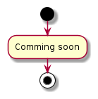

# Arduino based quadcopter project

# Software parts:

1. Arduino Sensor Calibration
1. Arduino ESC Calibration
1. Arduino Flight Controller Simple
1. Arduino Flight Controller

## Arduino Sensor Calibration

> Arduino software for checking if all sensors are working. Also if the remote sensors are attached correctly. Then it is used to detect the orientation of the IMU sensor to have valid ranges.
- Setup routine

- Loop routine

## Arduino ESC Calibration
> Routine to test the vibration of the certain speed controllers and rotors
- Setup routine

- Loop routine

## Arduino Flight Controller Simple
> Own draft of a flight controller based on YMFC code.
- Setup routine

- Loop routine

