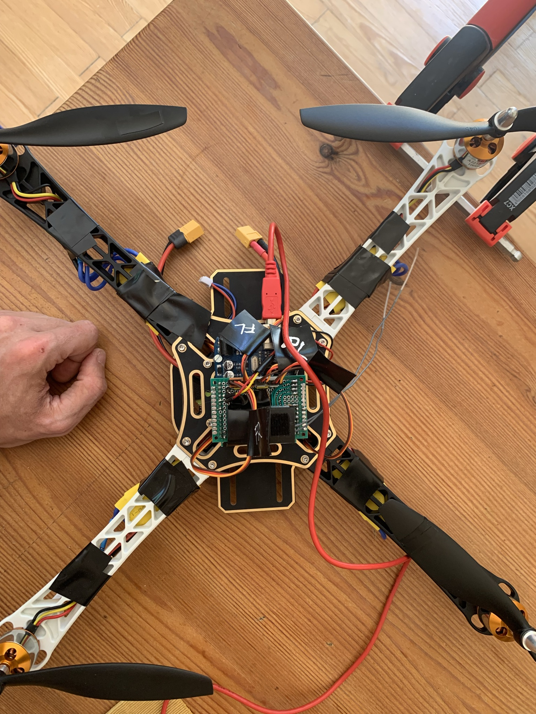
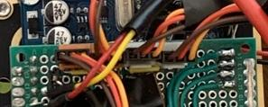

# Arduino based quadcopter project
> This projects is related to the YMFC from Youtube.


# Hardware

## Hardware multicopter orientation
> TODO Add image of multicopter

|  | BACK                               |                |
|----|-------------------------------------------|--------------------|
| **RIGHT**   | |**LEFT**  |
| | <center> **FRONT** </center>||

### Details
The arduino UNO ist located in the middle of the multicopter. The orientation is shown in the image. The usb port is the backside of the drone.
It has a connection to the remote sensor and reads in the pwm control signals from the remote control. Via I2C a MPU6050 is connected and can provide gyro and accelerometer data. The power supply is done via a power separation board to spread the power supply to every engine.

1. **Power Supply**
 
  The power is provided via a 11.7V 3 Cell LIPO accumulator
  The voltage is send to the esc and is converted to 5V to provide power to the arduino and the remote receiver.

1. **ESC Signal Connection**
  The connection of the esc cables to the sensor board is shown in the next image:
  

|Front Right | Rear Right| Rear Left| Front Left |
|---|---|---|----|
| *GPIO 4*|*GPIO 5*|*GPIO 6*|*GPIO 7*|
| CCW ⭯| CW ⭮ | CCW ⭯| CW ⭮ |

1. **Remote Signal Connection**
The signal of the remote receiver are processed via interrupt handling on the arduino, this is why i need to attach the ports to specific pins on the UNO. Because of a broken pin at GPIO8 it was not possible to use the same sketch as YMFC, so i need to shift the GPIO Interrupts by one. By this i was not able to use the remote LED on *GPIO 12*.

| CHANNEL 1  | CHANNEL 2 |CHANNEL 3|CHANNEL 4 |
|---|---|---|----|
| *GPIO 9*|*GPIO 10*|*GPIO 11*|*GPIO 12*|
| Roll 🡰 🡲 | Pitch 🡱 🡳| Yaw  ⭯ ⭮ | Throttle ⮥ ⮦ |


# Software parts:

1. [Arduino Sensor Calibration](./arduino_uno_sensor_calibration)
1. [Arduino ESC Calibration](./arduino_uno_esc_calibration)
1. [Arduino Flight Controller Simple](./arduino_uno_flight_controller_simple)
1. [Arduino Flight Controller](./arduino_uno_flight_controller)


# Safety Ideas

1. [**REQ1**] MC must be able to turn of startup state without motors are turning : **Checked**
1. [**REQ2**] MC should never start rotors: **Checked**
1. [**REQ3**] MC should start rotors only if throttle not zero and modus in start: **Checked**
1. [**REQ4**] MC must not be able to turn state to shutdown while flying : **UNCHECKED**!!!

```diff
+ [REQ1] MC must be able to turn of startup state without motors are turning : Checked 
+ [REQ2] MC should never start rotors: Checked
+ [REQ3] MC should start rotors only if throttle not zero and modus in start: Checked
- [REQ4] MC must not be able to turn state to shutdown while flying : UNCHECKED
```

**[FMEA](doc/risk-table-fmea.md)** Risk Table